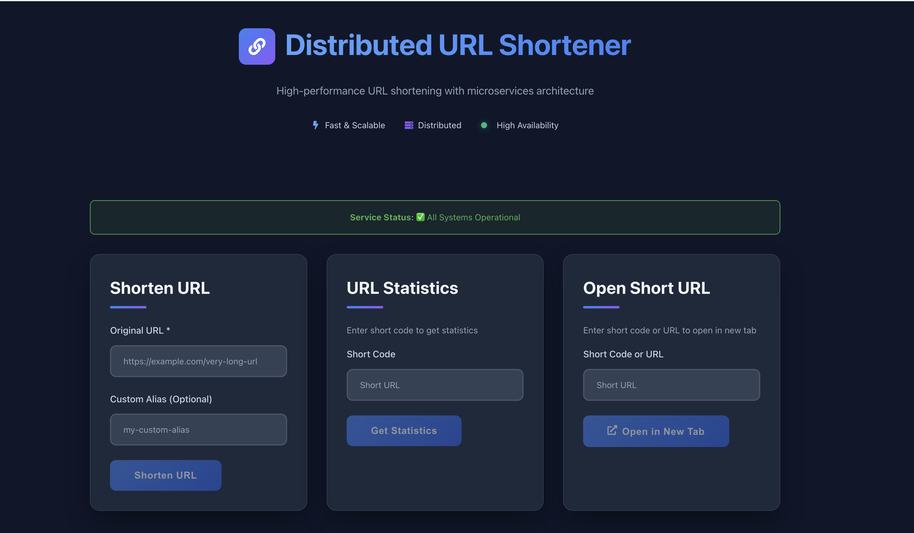

# URL Shortener – Distributed System Design

This repository contains a **microservice-based URL shortener** system, designed to showcase distributed systems, high availability, API gateway, caching and persistent storage patterns. The project is structured as a small, production-style system.

---

## Table of Contents

- [Overview](#overview)
- [Architecture](#architecture)
  - [Manifestation using containers](#manifestation-using-containers)
  - [Services](#services)
  - [High-level Request Flow](#high-level-request-flow)
- [Tech Stack](#tech-stack)
- [Getting Started](#getting-started)
  - [Prerequisites](#prerequisites)
  - [Running with Docker](#running-with-docker)
- [Configuration](#configuration)
- [API Overview](#api-overview)
- [Development Notes](#development-notes)
- [Future Improvements](#future-improvements)

---

## Overview

The system exposes a simple URL shortening API and a small frontend, but it is structured as a **set of services** that communicate through clear contracts. The goals of this project are:

- To demonstrate **clean separation of concerns** between gateway, business logic, persistence, and caching layers using microservices architecture.
- To practice **scalable design**, where each component can be independently scaled and deployed.
- To practice **high availability**, for each component by running multiple instances of a service behind a load balancer.

At a high level, the system lets you:

- Create a short URL for a long URL.
- Resolve a short URL and redirect to the original target.
- Track basic metrics or metadata around shortened URLs.

---

## Architecture

The project is split into multiple micro-services. A top level architecture diagram is shown below:


This architecture separates **public-facing access** from **internal service logic** to keep the system secure, scalable, and maintainable. Users reach the system through a **reverse proxy** in the public network, which handles HTTPS, routing, and protects the private network. Behind it, all application components live in a **private network**, where a **frontend service** communicates with an internal **API gateway** that controls and routes API requests. The gateway sends requests to the core **URL service**, which performs the business logic and relies on specialized internal components: a **storage service** for database access and a **cache service** for fast lookup. Postgres and Redis are never exposed directly; they are accessed only through these services.

### Manifestation using containers

The implemtation of architecture is done using docker containers in the following fashion:


In this implementation we took each logical block from the earlier design and turned it into one or more Docker containers wired together. At the very edge, the **Reverse proxy** is an Nginx container that accepts all external HTTP(S) traffic. It forwards requests to a **Gateway** container, which is our URL API gateway service running in Docker and offloading incoming HTTP(S) to internal gRPC calls. Behind that, we added an internal **URL-SVC load balancer** (another Nginx container) that distributes requests across two identical **URL-SVC** app containers (`URL-SVC-1` and `URL-SVC-2`) for horizontal scaling. The URL service then talks to two other tiers, each with the same pattern: a **STRG-SVC load balancer** in front of two **storage service** containers (`STRG-SVC-1`, `STRG-SVC-2`) that handle all communication with a single **Postgres** database container; and a **CACHE-SVC load balancer** in front of two **cache service** containers (`CACHE-SVC-1`, `CACHE-SVC-2`) that talk to a **Redis** container. So: every logical service is one or more Docker containers, and any service that needs to scale out has its own dedicated Nginx load-balancer container in front of multiple replicas.

### Services

- **gateway/**  
  - Edge layer / API Gateway.
  - Accepts HTTP requests from the frontend and external clients.
  - Offloads incomping HTTP requests to internal gRPC calls.
  - Routes requests to the appropriate backend services (e.g. `url-service`).
  - A central place for authentication, rate limiting, and request logging (where implemented).

- **url-service/**  
  - Core business logic for URL shortening.
  - Responsible for:
    - Generating short codes.
    - Validating input URLs.
    - Reading/writing URL records via `storage-service`.
    - Integrating with `cache-service` for fast lookups.

- **storage-service/**  
  - Persistence layer.
  - Manages **PostgreSQL** access and database schema.
  - Provides a clean interface for creating, reading, and updating URL records.

- **cache-service/**  
  - Caching layer (e.g., Redis or an in-memory store – see the implementation in this service).
  - Stores hot URL mappings (`short_code -> long_url`) to reduce load on the database.
  - Handles cache invalidation or TTL policies.

- **frontend/**  
  - Simple web UI for:
    - Submitting long URLs and receiving the shortened version.
    - Showing statistics for an existing short URL.

- **configs/**  
  - Configuration files (e.g. for load-balancers, database).
  
- **docker-compose.yaml**  
  - Orchestrates all services for local development.

### High-level Request Flow

1. **Create Short URL**
   1. Client / frontend sends a `POST /shorten` request to the **gateway**.
   2. Gateway forwards the request to **url-service**.
   3. `url-service` validates the long URL, generates a short code, and calls **storage-service** to persist it.
   4. `url-service` also updates **cache-service** with the new mapping.
   5. Gateway returns the short URL to the client.

2. **Resolve Short URL**
   1. Client requests `GET /:shortCode` from the **gateway**.
   2. Gateway asks **url-service** for the `shortCode`.
      - `url-service` checks if `shortCode` is present in cache → long URL is returned and the client is redirected.
      - If missing → **url-service** reads from **storage-service** and then updates the cache.
   3. Response is sent back as a redirect to the original URL.

## Tech Stack
- Backend
    - Go (primary backend language for services)
    - PostgreSQL (persistent storage)
    - Redis (caching)
- Frontend
    - React, HTML/CSS
- Infrastructure
    - Docker & Docker Compose

## Getting Started

### Prerequisites
* [Docker](https://www.docker.com/) & Docker Compose installed
* [Go](https://go.dev/) (if you want to run/build services manually)

### Running with Docker
The easiest way to run the full stack is via `docker-compose`.

From the project root:
```shell
$ docker-compose up --build
```

This will:
- Start the reverse-proxy, frontend, gateway, url-service, cache-service and storage-service.
- Start all load-balancers
- Create and initialize the database (according to the config in `configs/postgres/init-db.sql`).

Once everything is up, you can access:
Frontend UI: [http://localhost](http://localhost)
Gateway/API: [http://localhost:8080](http://localhost:8080)
(check docker-compose.yaml for the mappings)



### Configuration

Configurations for postgres and all the load-balancers is kept in the `configs/` directory. Some informatin is exposed through environment variables, depending on the service.

## API Overview

* Create a Short URL
Endpoint: `POST /shorten`

Body:
```json
{
    "url": "https://www.amazon.com"
}
```

Response:
```json
{   
    "short_code":"XQwJLm",
    "original_url":"https://www.amazon.com"
}
```

* Resolve a Short URL
Endpoint: `GET /:shortCode`

Behavior:
Looks up shortCode via cache → storage.
Returns a 301/302 redirect to the original long URL.

* Get URL Stats
Endpoint: `GET /stats/:shortCode`

Response:
```json
{
    "short_code": "XQwJLm",
    "click_count": 14,
    "created_at": "2025-12-03T04:19:47Z"}
```

## Development Notes

* Logs & Observability
- Each service logs requests and errors independently.
- For debugging, start by checking:
    - Gateway logs for errors routing requests.
    - `url-service` logs for business logic issues.
    - `storage-service` logs + DB logs for persistence problems.
    - `cache-service` logs for cache misses and errors.

* Testing
- Add unit tests around:
    - Short code generation.
    - URL validation.
    - Storage interactions (ideally with test DB / mocks).
    - Cache integration.

* Scalability
    - Services can be scaled horizontally (e.g., multiple instances behind a load balancer).
    - Cache reduces read load on the database.
    - Gateway can centralize cross-cutting concerns (like auth, rate limiting).

## Future Improvements
- Add user accounts and ownership of URLs.
- Implement rate limiting and API keys in the gateway.
- Harden the system with retries, circuit breakers, and timeouts.
- Add an ELK stack to gather logs in a single Kibana instance
- Export metrics for all the services to Grafana using Prometheus
- Add CI/CD workflows (GitHub Actions) for building, linting, and testing.
